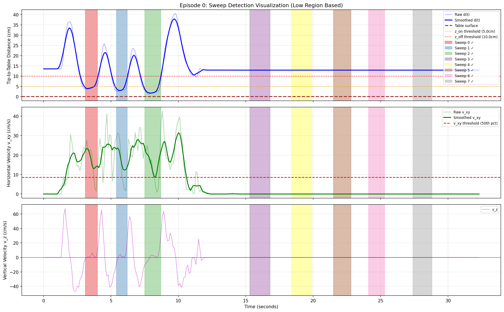

# Sweep-AutoSplit

基于 LeRobot 2.1 数据集的 Sweep（扫动）动作自动切分工具。

## 可视化演示

### 静态检测结果


### 动态检测过程
[查看视频演示](assets/sweep_detection_ep0000.mp4)

## 项目结构

```
Sweep-AutoSplit/
├── README.md                    # 本文档
├── requirements.txt             # Python 依赖
├── setup.py                     # 安装配置
├── pyproject.toml               # 项目配置
├── assets/                      # 可视化资源
└── sweep_auto_split/            # 主模块
    ├── config.py                # 配置参数定义
    ├── main.py                  # 主程序入口
    ├── data_loader.py           # LeRobot 数据加载器
    ├── kinematics.py            # 前向运动学计算
    ├── sweep_detector.py        # Sweep 端点检测 (核心算法)
    ├── action_detector.py       # 基于 Action 的检测方法
    ├── segment_calculator.py    # Segment 边界计算
    ├── signal_processing.py     # 信号处理工具
    ├── visual_checker.py        # 视觉质检模块
    ├── visualize_sweep.py       # 可视化工具 (图片/视频)
    ├── lerobot_exporter.py      # 数据集导出
    ├── mask_generator.py        # Mask 生成
    └── diagnostics.py           # 诊断统计
```

## 安装

```bash
cd Sweep-AutoSplit
pip install -e .
```

## 快速开始

### 1. 分析数据集（不导出）

```bash
python -m sweep_auto_split.main \
    --input /path/to/lerobot_dataset \
    --detection-method fk \
    --arm left \
    --analyze \
    --verbose
```

### 2. 完整处理并导出

```bash
python -m sweep_auto_split.main \
    --input /home/zeno-yifan/NPM-Project/lerobot21_dataset \
    --output /home/zeno-yifan/NPM-Project/datasets/sweep_to_E_and_recover_lerobot21_segmented_p1 \
    --detection-method fk \
    --arm both
```

### 3. 生成可视化

```bash
# 静态图片
python -m sweep_auto_split.visualize_sweep \
    --input /path/to/lerobot_dataset \
    --output ./sweep_viz \
    --max-episodes 5 \
    --arm left

# 动态视频
python -m sweep_auto_split.visualize_sweep \
    --input /path/to/lerobot_dataset \
    --output ./sweep_viz_video \
    --arm left \
    --video \
    --video-fps 15
```

## 检测算法说明

### 核心思想

Sweep（扫动）动作的特征是：**刷尖接近桌面时进行水平运动**。

算法基于两个关键信号：
- **d(t)** - 刷尖到桌面的距离（米）
- **v_xy(t)** - 水平速度（米/秒）

### 检测流程

```
1. 运动学计算
   └─ 从关节角度/末端位姿计算刷尖位置
   └─ p_tip = p_flange + R @ o_tip (刷尖偏移 30cm)
   └─ d(t) = n^T(p_tip - x0) (到桌面距离)

2. 信号平滑
   └─ 滑动平均窗口 (默认 7 帧)

3. 低位区间检测 (滞回阈值)
   └─ 进入: d(t) < z_on (5cm)
   └─ 退出: d(t) > z_off (10cm)
   └─ 端点: P_t0 = 进入时刻, P_t1 = 退出时刻

4. 有效性验证
   └─ 长度检查: 3 ≤ L23 ≤ 200 帧
   └─ 水平运动: v_xy > threshold
   └─ 真正低位: min(d) < z_off
```

### 滞回阈值图示

```
d(t) [cm]
    │
 10 ├─────────────────────  z_off (退出阈值)
    │     ╭──╮        ╭───╮
  5 ├─────┼──┼────────┼───┼──  z_on (进入阈值)
    │     │  │        │   │
    │     ↓  ↑        ↓   ↑
    ├─────[Sweep 0]───[Sweep 1]───→ t
```

## 命令行参数

### main.py 主要参数

| 参数 | 类型 | 默认值 | 说明 |
|------|------|--------|------|
| `--input`, `-i` | str | **必需** | 输入 LeRobot 数据集路径 |
| `--output`, `-o` | str | None | 输出数据集路径 |
| `--analyze` | flag | False | 只分析不导出 |
| `--detection-method` | str | "action" | 检测方法: `fk` 或 `action` |
| `--arm` | str | "left" | 使用哪只手臂: `left`, `right` 或 `both` |
| `--visual-check` | flag | False | 启用视觉质检 |
| `--verbose`, `-v` | flag | False | 详细输出 |

> **注意**: `--arm both` 模式会分别检测左右臂的 sweep，然后按时间顺序合并。适用于左右手交替扫动的任务。

### 检测参数

| 参数 | 类型 | 默认值 | 说明 |
|------|------|--------|------|
| `--z-on` | float | 0.05 | 低位区进入阈值 (米) |
| `--z-off` | float | 0.06 | 低位区退出阈值 (米) |
| `--smoothing-window` | int | 7 | 平滑窗口大小 |
| `--energy-percentile` | int | 60 | v_xy 阈值百分位数 |
| `--merge-gap` | int | 2 | 合并间隔帧数 |

### 导出参数

| 参数 | 类型 | 默认值 | 说明 |
|------|------|--------|------|
| `--H` | int | 30 | Action horizon |
| `--A-min` | int | 2 | Approach 最少帧数 |
| `--R-min` | int | 2 | Retreat 最少帧数 |
| `--export-mask` | flag | True | 导出 sweep mask |
| `--no-export-mask` | flag | - | 不导出 mask |

### visualize_sweep.py 参数

| 参数 | 类型 | 默认值 | 说明 |
|------|------|--------|------|
| `--input`, `-i` | str | **必需** | 输入数据集路径 |
| `--output`, `-o` | str | "./sweep_viz" | 输出目录 |
| `--max-episodes` | int | 5 | 最大处理 episode 数 |
| `--arm` | str | "left" | 使用哪只手臂: `left`, `right` 或 `both` |
| `--video` | flag | False | 生成动态视频 |
| `--video-fps` | int | 10 | 视频帧率 |

> **注意**: `--arm both` 模式下，可视化图表显示左臂运动学数据，但检测区间包含两只手臂的所有 sweep。

## 配置文件

所有参数也可以在 `config.py` 中的 `SweepSegmentConfig` 类中修改默认值：

```python
from sweep_auto_split.config import SweepSegmentConfig

config = SweepSegmentConfig(
    z_on=0.05,           # 低位区进入阈值 (米)
    z_off=0.10,          # 低位区退出阈值 (米)
    smoothing_window=7,  # 平滑窗口
    energy_percentile=60,# v_xy 阈值百分位数
    H=30,                # Action horizon
    active_arm="both",   # 使用哪只手臂: "left", "right", "both"
    verbose=True,        # 详细输出
)
```

## 依赖

- Python >= 3.8
- NumPy
- Matplotlib
- OpenCV (可选，用于视觉质检)
- FFmpeg (可选，用于视频生成)

## License

MIT
